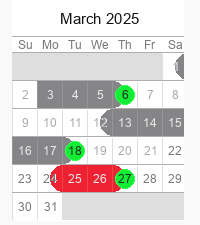

drawcal
=======

Python library for drawing a calendar images with events.



## Installation

The easiest way to install:

```bash
$ pip install -U drawcal
```

## Quickstart

Generate a calendar image for a given events file:

```bash
$ drawcal --events events.json
```
