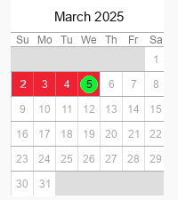
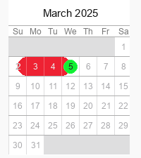
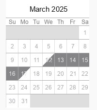
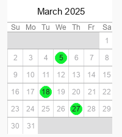

# Rendering

Structured events support three span styles:

## `filled`

Draws a solid rectangular span.



## `rounded`

Draws half-width rounded caps on the inside edges of the start and end dates.
This helps adjacent events avoid visually clobbering each other.



## `diagonal`

Draws diagonal caps similar to a gantt-style slash.



## Markers

Use `markers` to draw green marker circles on specific dates:

```json
{
  "start_date": "3/1/2025",
  "end_date": "3/5/2025",
  "markers": ["3/5/2025"]
}
```

Marker-only events are also supported:

```json
{
  "markers": ["3/5/2025"]
}
```



## Legacy Behavior

Legacy list-based events still render with the original checkout-style marker on
the day after the final date. Structured events do not do this unless you add
the marker explicitly.
